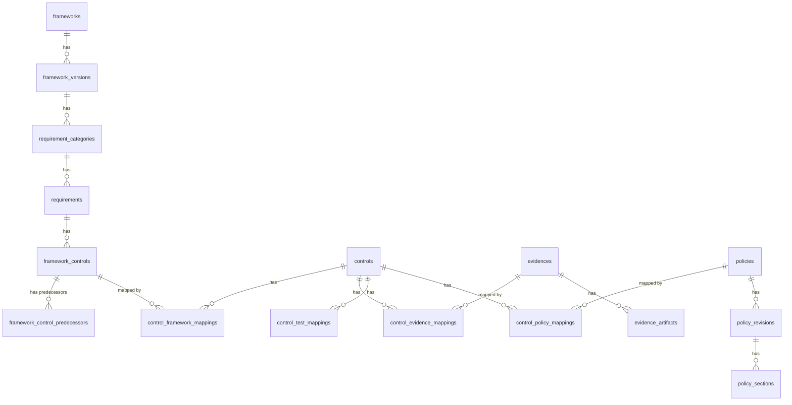

# ER図（MVP向け）

本ドキュメントは [domain-boundaries.md](./domain-boundaries.md) に基づくデータベース設計である。

---

## 設計方針

- 全テーブルのPKは **UUID v7** を使用
  - 時系列ソート可能（監査ログ・履歴表示に有利）
  - B-treeインデックス効率が高い（順序挿入）
  - Kotlin実装: `com.github.f4b6a3:uuid-creator` ライブラリ推奨
- テナント依存テーブルには `tenant_id` を持たせる
- 監査用カラム（created_at, updated_at）は全テーブルに付与
- テーブル名・カラム名は snake_case
- predecessorIds は別テーブル `framework_control_predecessors` で正規化

---

## 全体ER図



---

## 1. Framework境界（共通マスタ）

テナント非依存。規格カタログとして全テナントで共有される。

### frameworks

規格マスタ（SOC2、ISO27001、ISMAP等）

| カラム | 型 | 説明 |
|--------|-----|------|
| id | UUID | PK |
| name | VARCHAR(100) | 規格名（例：SOC 2） |
| description | TEXT | 説明 |
| created_at | TIMESTAMP | 作成日時 |
| updated_at | TIMESTAMP | 更新日時 |

### framework_versions

規格の版管理

| カラム | 型 | 説明 |
|--------|-----|------|
| id | UUID | PK |
| framework_id | UUID | FK → frameworks.id |
| version | VARCHAR(50) | 版名（例：2022、Type II） |
| status | VARCHAR(20) | DRAFT / ACTIVE / ARCHIVED |
| effective_date | DATE | 発効日 |
| created_at | TIMESTAMP | 作成日時 |
| updated_at | TIMESTAMP | 更新日時 |

### requirement_categories

章・ドメイン・カテゴリ

| カラム | 型 | 説明 |
|--------|-----|------|
| id | UUID | PK |
| framework_version_id | UUID | FK → framework_versions.id |
| parent_id | UUID | FK → requirement_categories.id（自己参照、NULL可） |
| name | VARCHAR(200) | カテゴリ名 |
| display_order | INT | 表示順 |
| created_at | TIMESTAMP | 作成日時 |
| updated_at | TIMESTAMP | 更新日時 |

### requirements

規格本文上の要求（意味単位）

| カラム | 型 | 説明 |
|--------|-----|------|
| id | UUID | PK |
| category_id | UUID | FK → requirement_categories.id |
| code | VARCHAR(50) | 要求コード（例：CC6.1） |
| title | VARCHAR(255) | タイトル |
| text | TEXT | 規格本文 |
| display_order | INT | 表示順 |
| created_at | TIMESTAMP | 作成日時 |
| updated_at | TIMESTAMP | 更新日時 |

### framework_controls

規格上の実施項目定義

| カラム | 型 | 説明 |
|--------|-----|------|
| id | UUID | PK（内部主キー、不変） |
| requirement_id | UUID | FK → requirements.id |
| framework_version_id | UUID | FK → framework_versions.id（冗長だがクエリ効率化用） |
| canonical_key | VARCHAR(100) | 規格側の安定キー（**版込み必須**、例：`ISO27001:2022:A.5.15`） |
| display_code | VARCHAR(50) | 画面表示用番号（例：A.5.15） |
| title | VARCHAR(255) | タイトル |
| text | TEXT | 規格本文の文言 |
| content_hash | VARCHAR(64) | 正規化テキストのハッシュ（SHA-256） |
| mapping_policy | VARCHAR(20) | AUTO_MIGRATE / MANUAL_REVIEW / DEPRECATED |
| display_order | INT | 表示順 |
| created_at | TIMESTAMP | 作成日時 |
| updated_at | TIMESTAMP | 更新日時 |

**インデックス:**
- UNIQUE(canonical_key) ※canonical_keyは版込み形式（例：`ISO27001:2022:A.5.15`）を強制

### framework_control_predecessors

FrameworkControlの前版との対応（改訂引き継ぎ用）

| カラム | 型 | 説明 |
|--------|-----|------|
| id | UUID | PK |
| framework_control_id | UUID | FK → framework_controls.id（新版側） |
| predecessor_id | UUID | FK → framework_controls.id（旧版側） |
| status | VARCHAR(20) | SUGGESTED / CONFIRMED / REJECTED |
| created_at | TIMESTAMP | 作成日時 |

**制約:**
- UNIQUE(framework_control_id, predecessor_id)

---

## 2. Control境界（テナント固有）

テナントの運用状態を管理する中核境界。

### controls

テナントの運用管理対象

| カラム | 型 | 説明 |
|--------|-----|------|
| id | UUID | PK |
| tenant_id | UUID | テナントID |
| name | VARCHAR(200) | Control名 |
| description | TEXT | 説明 |
| status | VARCHAR(20) | NOT_STARTED / IN_PROGRESS / COMPLETED |
| owner_id | UUID | 責任者ID（将来的にusersテーブルへFK） |
| note | TEXT | 補足情報 |
| custom_fields | JSONB | カスタムフィールド |
| created_at | TIMESTAMP | 作成日時 |
| updated_at | TIMESTAMP | 更新日時 |

**インデックス:**
- INDEX(tenant_id)
- INDEX(tenant_id, status)

### control_framework_mappings

Control ↔ FrameworkControl（多:多）

| カラム | 型 | 説明 |
|--------|-----|------|
| id | UUID | PK |
| tenant_id | UUID | テナントID（RLS・誤JOIN防止用） |
| control_id | UUID | FK → controls.id |
| framework_control_id | UUID | FK → framework_controls.id |
| created_at | TIMESTAMP | 作成日時 |

**制約:**
- UNIQUE(control_id, framework_control_id)

**インデックス:**
- INDEX(tenant_id)

### control_evidence_mappings

Control ↔ Evidence（多:多）

| カラム | 型 | 説明 |
|--------|-----|------|
| id | UUID | PK |
| tenant_id | UUID | テナントID（RLS・誤JOIN防止用） |
| control_id | UUID | FK → controls.id |
| evidence_id | UUID | FK → evidences.id |
| note | TEXT | 紐づけ理由・補足（なぜこの証跡で満たすか） |
| created_at | TIMESTAMP | 作成日時 |

**制約:**
- UNIQUE(control_id, evidence_id)

**インデックス:**
- INDEX(tenant_id)

### control_test_mappings

Control ↔ Test（多:多）

| カラム | 型 | 説明 |
|--------|-----|------|
| id | UUID | PK |
| tenant_id | UUID | テナントID（RLS・誤JOIN防止用） |
| control_id | UUID | FK → controls.id |
| test_id | UUID | FK → tests.id（将来実装） |
| created_at | TIMESTAMP | 作成日時 |

**制約:**
- UNIQUE(control_id, test_id)

**インデックス:**
- INDEX(tenant_id)

### control_policy_mappings

Control ↔ Policy（多:多）

| カラム | 型 | 説明 |
|--------|-----|------|
| id | UUID | PK |
| tenant_id | UUID | テナントID（RLS・誤JOIN防止用） |
| control_id | UUID | FK → controls.id |
| policy_id | UUID | FK → policies.id |
| created_at | TIMESTAMP | 作成日時 |

**制約:**
- UNIQUE(control_id, policy_id)

**インデックス:**
- INDEX(tenant_id)

---

## 3. Evidence境界（テナント固有）

監査に耐える形で証跡を保全・管理する。

### evidences

証跡の論理単位

| カラム | 型 | 説明 |
|--------|-----|------|
| id | UUID | PK |
| tenant_id | UUID | テナントID |
| name | VARCHAR(200) | 証跡名 |
| description | TEXT | 説明 |
| created_at | TIMESTAMP | 作成日時 |
| updated_at | TIMESTAMP | 更新日時 |

**インデックス:**
- INDEX(tenant_id)

### evidence_artifacts

ファイル/URL/スナップショット等の実体

| カラム | 型 | 説明 |
|--------|-----|------|
| id | UUID | PK |
| evidence_id | UUID | FK → evidences.id |
| artifact_type | VARCHAR(20) | FILE / URL / SNAPSHOT |
| file_path | VARCHAR(500) | ファイルパス（S3キー等） |
| url | VARCHAR(2000) | 外部URL |
| hash | VARCHAR(64) | SHA-256ハッシュ |
| size_bytes | BIGINT | ファイルサイズ |
| collected_at | TIMESTAMP | 取得日時 |
| created_at | TIMESTAMP | 作成日時 |
| updated_at | TIMESTAMP | 更新日時 |

**TODO（MVP後）:**
- CHECK制約追加: artifact_type と file_path/url の排他性をDBレベルで保証
  - `FILE` → file_path NOT NULL, url NULL
  - `URL` → url NOT NULL, file_path NULL
  - `SNAPSHOT` → file_path NOT NULL
- MVPではアプリ層でバリデーション

---

## 4. Policy境界（テナント固有）

テナントの社内規程を管理し、改訂履歴を保持する。

### policies

社内規程

| カラム | 型 | 説明 |
|--------|-----|------|
| id | UUID | PK |
| tenant_id | UUID | テナントID |
| name | VARCHAR(200) | 規程名 |
| description | TEXT | 説明 |
| created_at | TIMESTAMP | 作成日時 |
| updated_at | TIMESTAMP | 更新日時 |

**インデックス:**
- INDEX(tenant_id)

### policy_revisions

改訂・版

| カラム | 型 | 説明 |
|--------|-----|------|
| id | UUID | PK |
| policy_id | UUID | FK → policies.id |
| version | VARCHAR(50) | 版番号（例：1.0、2.1） |
| status | VARCHAR(20) | DRAFT / ACTIVE / ARCHIVED |
| effective_date | DATE | 発効日 |
| content | TEXT | 規程本文（または参照パス） |
| created_at | TIMESTAMP | 作成日時 |
| updated_at | TIMESTAMP | 更新日時 |

### policy_sections

章・条・項

> **MVP検討事項:** 条文構造化は差別化点だが実装工数が大きい。
> MVPでは `policy_revisions.content` に本文を集約し、`policy_sections` は後から導入する段階設計も可。

| カラム | 型 | 説明 |
|--------|-----|------|
| id | UUID | PK |
| policy_revision_id | UUID | FK → policy_revisions.id |
| parent_id | UUID | FK → policy_sections.id（自己参照、NULL可） |
| section_number | VARCHAR(20) | 条項番号（例：1.2.3） |
| title | VARCHAR(200) | タイトル |
| content | TEXT | 本文 |
| display_order | INT | 表示順 |
| created_at | TIMESTAMP | 作成日時 |
| updated_at | TIMESTAMP | 更新日時 |

---

## 境界間の関係まとめ

```
┌─────────────────────────────────────────────────────────────────────┐
│  Framework境界（共通マスタ）                                        │
│                                                                      │
│  frameworks → framework_versions → requirement_categories           │
│                    → requirements → framework_controls              │
│                                          ↓                          │
│                          framework_control_predecessors             │
│                                          │                          │
└──────────────────────────────────────────│──────────────────────────┘
                                           │
                      control_framework_mappings（多:多）
                                           │
┌──────────────────────────────────────────│──────────────────────────┐
│  Control境界（テナント固有）              ↓                          │
│                                                                      │
│                              controls                                │
│                                 │                                    │
│            ┌────────────────────┼────────────────────┐              │
│            │                    │                    │              │
│   control_evidence_mappings  control_test_mappings  control_policy_mappings
│            │                    │                    │              │
└────────────│────────────────────│────────────────────│──────────────┘
             │                    │                    │
             ▼                    ▼                    ▼
┌────────────────────┐    ┌────────────┐    ┌─────────────────────────┐
│  Evidence境界      │    │  (Test)    │    │  Policy境界             │
│                    │    │  将来実装  │    │                         │
│  evidences         │    └────────────┘    │  policies               │
│    → evidence_     │                      │    → policy_revisions   │
│      artifacts     │                      │        → policy_sections│
└────────────────────┘                      └─────────────────────────┘
```
